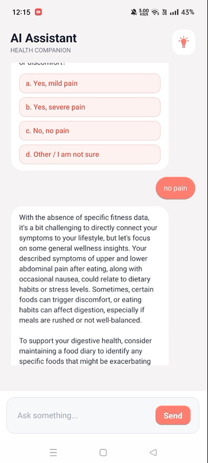
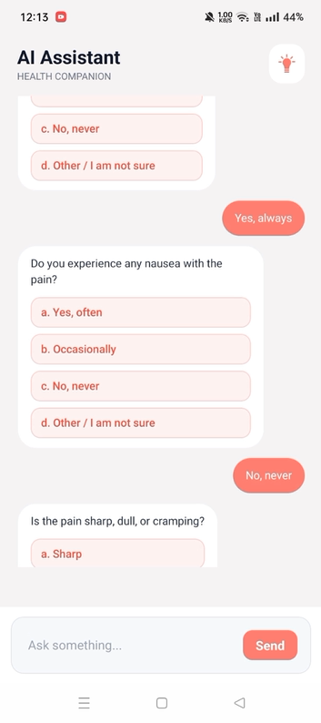

# Neuraliosis: The AI Bridge Between Symptom and Care

Neuraliosis is a bold reimagining of symptom triage: an elegant mobile assistant that turns confused, noisy symptom descriptions into fast, evidence-backed care recommendations, and it shows its work.

**Why this is compelling**

- People waste time on imprecise symptom searches or incur unnecessary ER costs; Neuraliosis fixes that with a conversational triage flow that blends personal sensors, targeted Q&A, and clinical evidence.
- Competitive moat: RAG-backed recommendations with provenance, plus behavioral signals from fitness data, create defensible quality and better conversion to care.

**One-liner**: a fitness-aware, RAG-anchored symptom assistant that triages, recommends safe OTC options, and escalates to booked care when needed.

  
  
  

## How it works

- Parse: intent & symptom extraction.
- Score: confidence model combines clinical heuristics and device data.
- Ask: 12-15 micro-questions to clarify ambiguous inputs.
- Retrieve: semantic retrieval returns top-k medical passages with source metadata.
- Synthesize: LLM composes a short, grounded recommendation and referral flag.

## RAG: our technical advantage

RAG is not an add-on, it's the trust layer.

- Curated knowledge: clinical articles, guidelines, and verified JSON records.
- Embeddings: convert chunks into vectors; we use robust embeddings ( `text-embedding-3-small`).
- Vector store: Chroma holds vectors + metadata; retriever returns evidence with provenance.
- Prompting enforces grounding: the model must cite top passages when synthesizing outputs.
- Auditability: every recommendation includes sources and a confidence score for clinical review.

Business impact: RAG reduces hallucination, supports regulatory review, and lets us productize evidence-driven workflows for employers and payers.

## GTM & Monetization (high level)

- B2C: viral, free tier with health-report sharing and OTC referrals.
- B2B: employer wellness pilots, payer analytics, and licensing for care pathways.
- Revenue: ads + per-consultation fees + enterprise contracts.

## Demo visuals

|                                        |                                        |                                        |
| -------------------------------------: | :------------------------------------: | :------------------------------------- |
|  |  |  |
|  |  |  |
|  |   |   |

## Tech snapshot

- Chunking: ~500-char chunks with 50-char overlap.
- Retrieval: top-k semantic search with source attribution.
- Models: LLMs for synthesis, embeddings for retrieval, Chroma vector store.
- Safety: critical-warning bypass and mandatory referral on red-flag symptoms.
